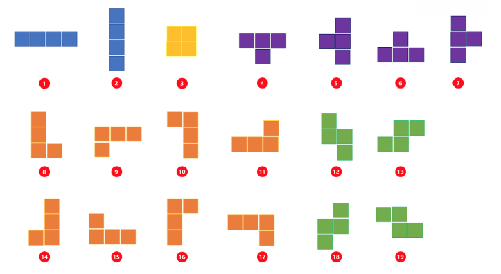

# 14500



- 순수한 풀이
    - 위 사진의 1~19번 모든 경우의 수를 셈
- DFS 풀이
    - 일반적인 DFS로는 1~3번, 8번~19번 까지는 DFS로 추적 가능
    - 하지만, 4~7번은 DFS로 추적이 불가능하다.
    - 따라서 4~7번만 따로 순수하게 푼다.

	- 최적의 풀이 : DFS를 활용하여 idx 1일 때에는 BFS처럼 동작하도록 구현하여 풀었다.

- BFS 풀이(안 됨)
	- BFS에서는 DFS처럼 왔던 곳을 다시 visit하도록 구현하는 것이 불가능해서 안 된다.
	- 만약 visited 배열을 두지 않고 전체 순회한다면 시간초과

```python

# 순수한 풀이
n, m = map(int, input().split())
arr = []

for _ in range(n):
    arr.append(list(map(int, input().split())))

def get_tmp_max(tmp):
    tmp_result = []

    for k in range(len(tmp)):
        for i in range(0, len(arr)-len(tmp[k])+1):
            for j in range(0, len(arr[0])-len(tmp[k][0])+1):

                # 원래 배열 슬라이스
                tmp_arr = [row[j:j+len(tmp[k][0])] for row in arr[i:i+len(tmp[k])]]

                # 슬라이스랑 tmp 배열 비교해서 1이면 다 더하기
                tmp_sum = 0
                for m in range(len(tmp_arr)):
                    for n in range(len(tmp_arr[0])):
                        if(tmp[k][m][n]==1):
                            tmp_sum = tmp_sum + tmp_arr[m][n]

                tmp_result.append(tmp_sum)
    return max(tmp_result)

# 모든 경우를 센다
def type1():
    tmp1 = [[1,1,1,1]]
    tmp2 = [[1], [1], [1], [1]]

    tmp = [tmp1] + [tmp2]

    return get_tmp_max(tmp)

def type2():
    tmp1 = [[1,1], [1,1]]

    tmp = [tmp1]

    return get_tmp_max(tmp)

def type3():
    tmp1 = [[1,0],[1,0],[1,1]]
    tmp2 = [[0,1],[0,1],[1,1]]
    tmp3 = [[1,1],[1,0],[1,0]]
    tmp4 = [[1,1],[0,1],[0,1]]
    tmp5 = [[1,1,1],[0,0,1]]
    tmp6 = [[1,1,1],[1,0,0]]
    tmp7 = [[0,0,1],[1,1,1]]
    tmp8 = [[1,0,0],[1,1,1]]

    tmp = [tmp1] + [tmp2] + [tmp3] + [tmp4] + [tmp5] + [tmp6] + [tmp7] + [tmp8]

    return get_tmp_max(tmp)

def type4():
    tmp1 = [[1,0], [1,1], [0,1]]
    tmp2 = [[0,1], [1,1], [1,0]]
    tmp3 = [[1,1,0], [0,1,1]]
    tmp4 = [[0,1,1], [1,1,0]]

    tmp = [tmp1] + [tmp2] + [tmp3] + [tmp4]

    return get_tmp_max(tmp)

def type5():
    tmp1 = [[1,1,1], [0,1,0]]
    tmp2 = [[0,1,0], [1,1,1]]
    tmp3 = [[1,0], [1,1], [1,0]]
    tmp4 = [[0,1], [1,1], [0,1]]

    tmp = [tmp1] + [tmp2] + [tmp3] + [tmp4]

    return get_tmp_max(tmp)

result = []
result.append(type1())
result.append(type2())
result.append(type3())
result.append(type4())
result.append(type5())

print(max(result))
```

```python
# DFS + 4~7(순수한 풀이)
import sys
input = sys.stdin.readline

def dfs(r, c, idx, total):
    global ans
    if idx == 3:
        if total > ans:
            ans = total
    else:
        for i in range(4):
            nr = r + dr[i]
            nc = c + dc[i]
            if 0 <= nr < N and 0 <= nc < M:
                if visit[nr][nc] == 0:
                    visit[nr][nc] = 1
                    dfs(nr, nc, idx + 1, total + arr[nr][nc])
                    visit[nr][nc] = 0

def block(r, c, total):
    global ans
    make_block = 0
    for i in range(4):
        nr = r + dr[i]
        nc = c + dc[i]
        if 0 <= nr < N and 0 <= nc < M:
            make_block += 1
            total += arr[nr][nc]

    if make_block == 3:
        if total > ans:
            ans = total

    if make_block == 4:
        for i in range(4):
            nr = r + dr[i]
            nc = c + dc[i]
            total -= arr[nr][nc]
            if total > ans:
                ans = total
            total += arr[nr][nc]


N, M = map(int, input().split())
arr = [list(map(int, input().split())) for _ in range(N)]
visit = [([0] * M) for _ in range(N)]
dr = [-1, 0, 1, 0]
dc = [0, 1, 0, -1]
ans = 0

for r in range(N):
    for c in range(M):
        visit[r][c] = 1
        dfs(r, c, 0, arr[r][c])
        block(r, c, arr[r][c])
        visit[r][c] = 0

print(ans)
```

```python
# DFS + 4~7에서는 BFS처럼 동작하도록 하는 최적의 풀이
import sys
input = sys.stdin.readline

def dfs(r, c, idx, total):
    global ans
    if ans >= total + max_val * (3 - idx):
        return
    if idx == 3:
        ans = max(ans, total)
        return
    else:
        for i in range(4):
            nr = r + dr[i]
            nc = c + dc[i]

            if 0 <= nr < N and 0 <= nc < M and visit[nr][nc] == 0:
		# BFS처럼 동작하도록 하는 부분
		if idx == 1:
			visit[nr][nc] = 1
			dfs(r, c, idx + 1, total + arr[nr][nc])
			visit[nr][nc] = 0
		visit[nr][nc] = 1
		dfs(nr, nc, idx + 1, total + arr[nr][nc])
		visit[nr][nc] = 0


N, M = map(int, input().split())
arr = [list(map(int, input().split())) for _ in range(N)]
visit = [([0] * M) for _ in range(N)]
dr = [-1, 0, 1, 0]
dc = [0, 1, 0, -1]
ans = 0
max_val = max(map(max, arr))

for r in range(N):
    for c in range(M):
        visit[r][c] = 1
        dfs(r, c, 0, arr[r][c])
        visit[r][c] = 0

print(ans)
```
